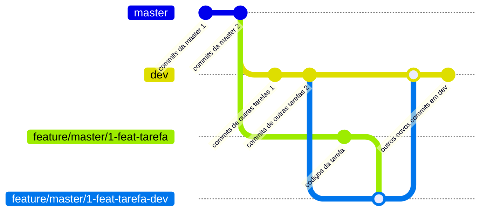

# tecnicas-git

## Manobra para mergiar uma tarefa em dev, mesmo dev contendo tarefas novas que ainda não foram para master

```mermaid
%%{init: { 'gitGraph': {'mainBranchName': 'master'}} }%%
    gitGraph
        commit id: "commits da master 1"
        commit id: "commits da master 2"
        branch dev
        checkout dev
        commit id: "commits de outras tarefas 1"
        commit id: "commits de outras tarefas 2"
        checkout master
        branch feature/master/1-feat-tarefa
        checkout feature/master/1-feat-tarefa
        commit id: "códigos da tarefa"
        checkout dev
        branch feature/master/1-feat-tarefa-dev
        checkout feature/master/1-feat-tarefa-dev
        merge feature/master/1-feat-tarefa
        checkout dev
        merge feature/master/1-feat-tarefa-dev
        commit id: "outros novos commits em dev"
```
